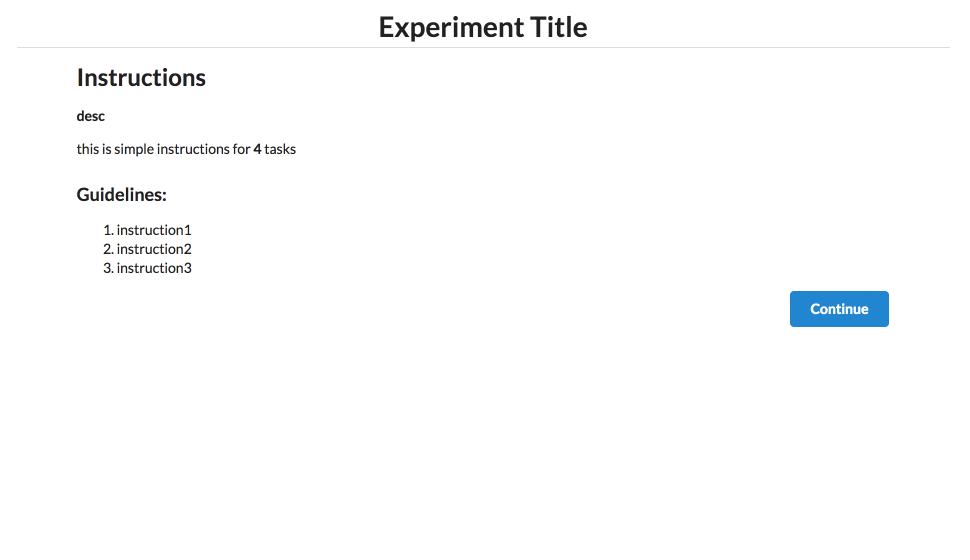

# Generalized MTurk Task Template
A general-purpose template for Amazon Mechanical Turk tasks.

### Development
Run `make watch` to watch SCSS files and compile to CSS. Run something like `python -m SimpleHTTPServer` to see the page locally.

### Customization
This framework can be used to create MTurk HITs, broken up into discrete repeated "tasks". 

To define your own MTurk HIT, you only need to change things in three places:

#### `config.json`
Here, you can define your HIT's name, description, number of tasks, instructions, etc.

Fields:
* `meta.title` - the title of your task, displayed in the page title
* `meta.description` - a short overview of your task's purpose, displayed as bolded text right below the page title
* `meta.numTasks` - the number of subtasks your task will have
* `meta.disclaimer` - the experiment disclaimer text displayed at the bottom of the page
* `instructions.simple` - short instruction paragraph displayed below the task description. You can include HTML tags here!
* `instructions.steps` - an array of instruction strings, displayed as a bulleted list on the page. You can include HTML tags here!
* `instructions.images` - an array of URLs for demo gifs on the instruction page. One of these will be displayed randomly on each page load.
* `submitUrl` - the URL to submit the task to. Usually "https://workersandbox.mturk.com/mturk/externalSubmit" or "https://www.mturk.com/mturk/externalSubmit".

#### `index.html`
Find the section marked `<!-- vv CUSTOM EXPERIMENT MARKUP GOES HERE vv -->`, and add your custom HTML elements in that section (e.g. image divs, input boxes). Add `id`s to those HTML elements so you can easily refer to them with JQuery in the page's JavaScript (see `assets/js/custom.js`).

#### `assets/js/custom.js`
Fill out the 4 functions: `loadTasks`, `showTask`, `collectData`, and `validateTask`. These define behavior for loading initial data, displaying a task, storing data from a task, and validating a task.

### Setting up the MTurk task
Use `script/create_hit.rb` to create a HIT.

### Screenshots
Here's a demo of the task interface:

